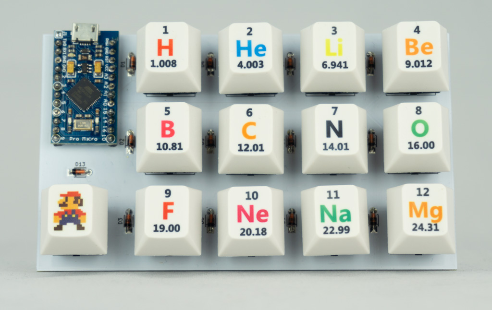

# Mini Matrix Keyboard



## Purpose
This repository contains a [PCB](images/mini_matrix_keyboard_pcb.jpg) and software to build a small and simple matrix keyboard.

## Components needed
* 1 Pro Micro
* 13 Cherry MX switches
* 13 diodes (1N4148)
* 1 micro USB cable
* (optional) 13 keycaps

## Programming the Pro Micro

### Method 1: Arduino IDE
Connect the pro micro to a USB port. Open the Arduino IDE. Open `mini_matrix_keyboard.ino`. Set Tools > Board > Leonardo. Also select the correct port. Click on 'Upload'.

### Method 2: Linux commandline
Make sure you have installed `arduino-mk`, `avrdude`, `gcc-avr`. You can use something like
```
sudo apt install arduino-mk avrdude gcc-avr
```

Go to the `mini_matrix_keyboard_ini` folder and type
```
make upload
```

## Setting different characters for the keys
You can specify which characters correspond to which keys in line 48 of the script.
